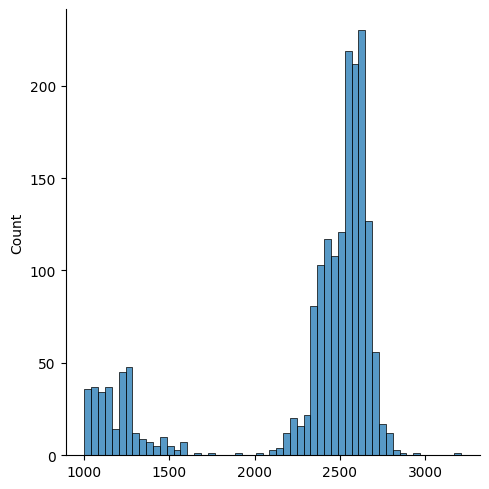
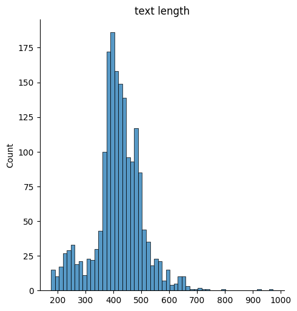
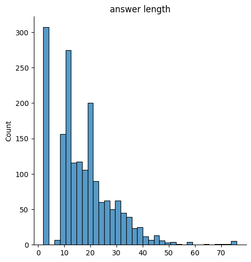
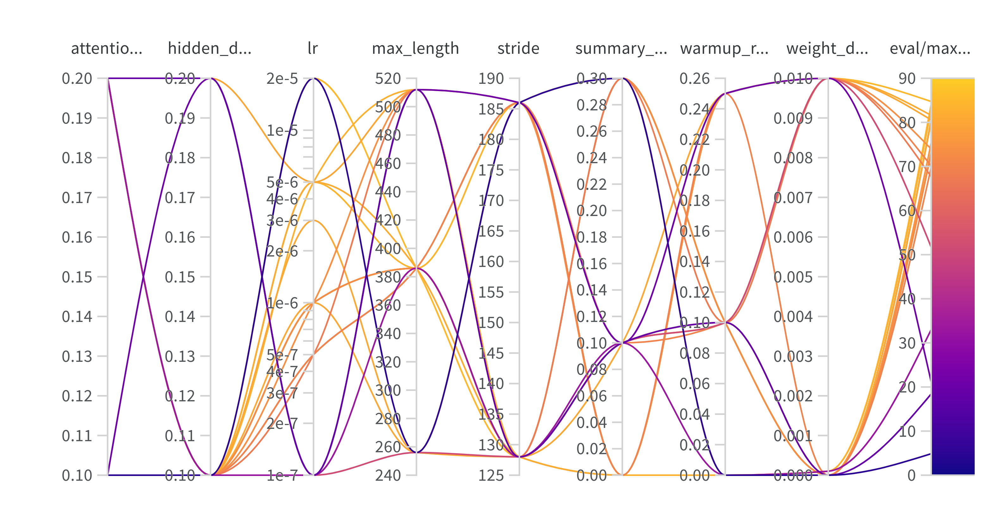
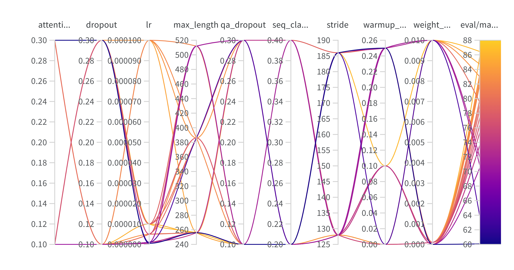
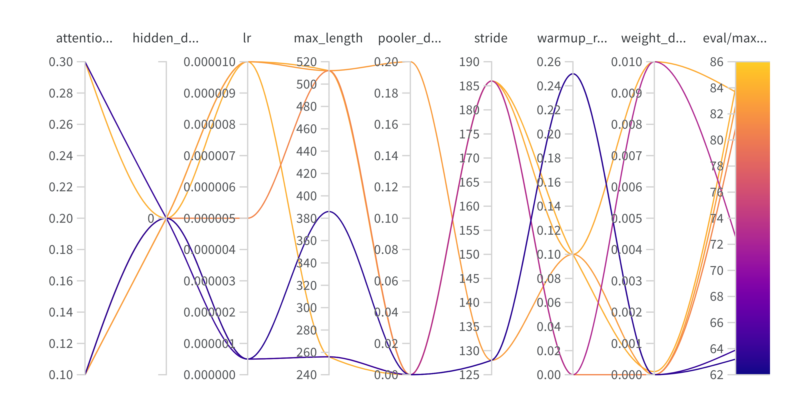

# document-extractor 📄

Extract part from document that corresponds to the specified label

## Content 📖

- [Stack of technologies](#Stack-of-technologies)
- [Task description](#Task-description)
- [exploratory data analysis](#EDA)
- [Proposed solution](#proposed-solution)
- [How to improve?](#how-to-improve)

## Stack of technologies 🏗

- Python 🐍
- Transformers 🤗
- Wandb 🪄

## Task description 📋

For raw text of document, need to extract part that corresponds to the specified label.
There are  types of labels.
Also, no answer("") is possible.

So, looks like question answering task. There are lots of pretrained models on [squadv2](https://huggingface.co/datasets/squad_v2) dataset, that is why I will fine-tune some of them.

## EDA 🔎

Number of documents with "обеспечение исполнения контракта": 988
Number of documents with "обеспечение гарантийных обязательств": 811
Amount of "обеспечение исполнения контракта" with empty part: 4
Amount of "обеспечение гарантийных обязательств" with empty part: 303

Even classes of labels seem balanced, but 37% of "обеспечение гарантийных обязательств" has empty text in extracted part.

So for train test split, I will use stratified strategy over random_split.

Lengths of documents:

Lengths of tokenized text:

Lengths of tokenized answer:

## Proposed solution 🚳

For tokenizing text I trained [custom tokenizer](https://huggingface.co/abletobetable/ru-document-tokenizer).

Choose some models for finetuning:
* [deberta](https://huggingface.co/deepset/deberta-v3-large-squad2)
* [distilbert](https://huggingface.co/AndrewChar/model-QA-5-epoch-RU)
* [mdeberta](https://huggingface.co/timpal0l/mdeberta-v3-base-squad2)

Set configs for hyperparameters optmization:

* *max_length* of tokenized text input
* *stride* for tokenizing text
* *dropout* layers in model
* *learning rate*
* *warmup_ratio*
* *weight_decay* strategy

Hyperparams optimization plots on validation test:

deberta:

distilbert:

mdeberta:

Then for best set of parameters I trained again models and test them on test set:

* deberta:

    exact_match: 83.9

    f1_score: 96.6

* distilbert:

    exact_match: 84.7

    f1_score: 96.8

* mdeberta:

    exact_match: 83.6

    f1_score: 97.14

I also add models on model hub:

[deberta](https://huggingface.co/abletobetable/deberta-ru-qa), [distilbert](https://huggingface.co/abletobetable/distilbert-ru-qa), 
[mdeberta](https://huggingface.co/abletobetable/mdeberta-ru-qa)

## How to improve 🔨
And what could be done more:

1. I trained a new tokenizer for this task, and it will be great to compare the old and new one on the corresponding task.
2. For hyperparameters optimization, I made only few iterations of random search, so I can use this results for Bayes optimization.

## Feel free to contact with me 📞

https://t.me/abletobetable

abletobetable@mail.ru